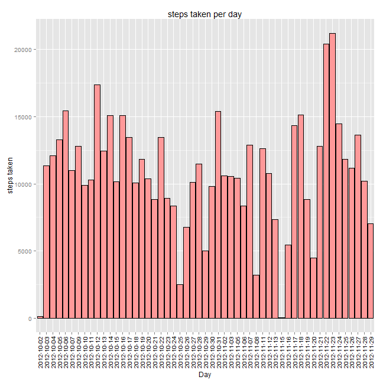
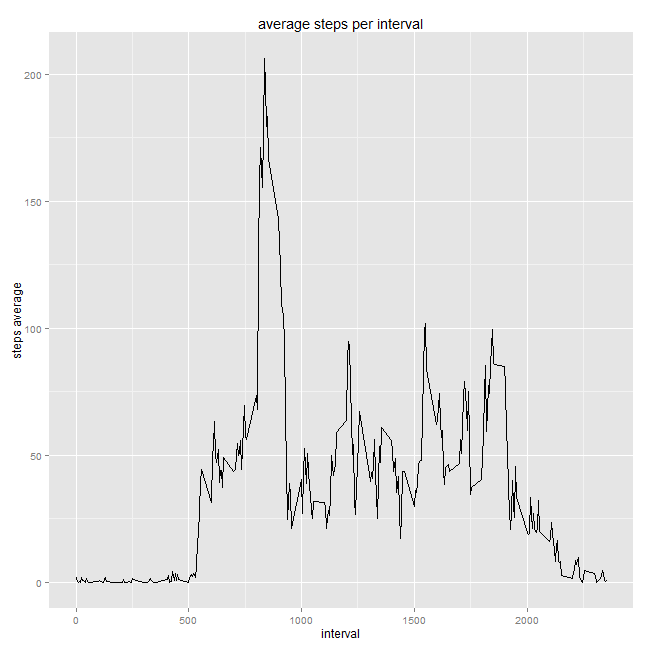
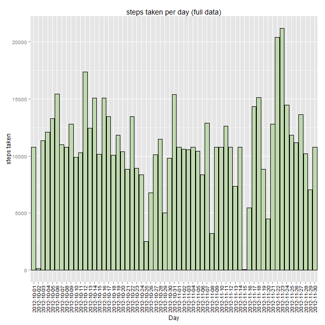
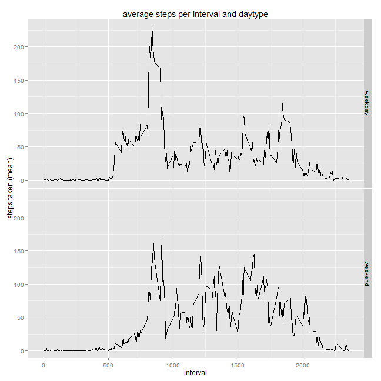

# Reproducible Research: Peer Assessment 1
_____________________________________________________________________________

## Loading and preprocessing the data

Read the data file with the appropiate arguments:

```r
data <- read.csv("activity.csv", 
                 sep =",", 
                 header=TRUE, 
                 colClasses=c("numeric", "Date", "factor"))
```

We're allowed to ignore NA values for the first part, so leave them out to create a "complete" dataset:

```r
completedata <- subset(data, complete.cases(data))
```

_____________________________________________________________________________

## What is mean total number of steps taken per day?

Calculate total number of steps taken per day:

```r
library(plyr)

stepsperday <- ddply(completedata, 
                     "date", 
                     summarise,
                     total_steps = sum(steps))
```

And plot the histogram:

```r
library(ggplot2)

opt <- options("scipen" = 20)
g <- ggplot(stepsperday, aes(factor(date), total_steps))
g <- g + geom_histogram(stat = "identity",fill="#FF9999", colour="black")
g <- g + theme(axis.text.x=element_text(angle=90,hjust=1,vjust=0.5, colour="black"))
g + labs(y = "steps taken", x = "Day", title = "steps taken per day")
```

 

* *Calculate and report mean and median values of the steps taken per day:*

```r
mean(stepsperday$total_steps)
```

```
## [1] 10766
```

```r
median(stepsperday$total_steps)
```

```
## [1] 10765
```

_____________________________________________________________________________

## What is the average daily activity pattern?

Calculate average of steps taken per 5-minute interval:

```r
stepsperinterval <- ddply(completedata, 
                          "interval", 
                          summarise, 
                          mean_steps = mean(steps))
```

And make a time series plot: 

```r
g <- ggplot(stepsperinterval, aes(as.integer(levels(interval)), mean_steps))
g <- g + geom_line()
g + labs(x = "interval", y = "steps average", title = "average steps per interval")
```

 


* *Which 5-minute interval, on average across all the days in the dataset, contains
the maximum number of steps?*

Calculate maximum number of steps taken per 5-minute interval:

```r
maxstepsperinterval <- ddply(completedata, 
                            "interval", 
                            summarise, 
                            max_steps = max(steps))
```

Extract interval with maximum steps:

```r
subset(maxstepsperinterval, max_steps == max(max_steps), select = "interval")
```

```
##     interval
## 244      615
```

_____________________________________________________________________________

## Imputing missing values

Calculate and report the total number of missing values in the dataset:

```r
sum(!complete.cases(data))
```

```
## [1] 2304
```

**How to fill missing values in the dataset?**  
In the initial dataset we're missing some values in the steps count column. As seen in the "daily activity pattern" exercise the mean steps per 5-minute interval is available for all intervals, so we'll use that data to fill the initial dataset.

Create a new dataset that is equal to the original dataset but with the missing data filled in:

```r
missingvalues <- which(is.na(data$steps))
intervalsneeded <- data$interval[(missingvalues)]
data$steps[(missingvalues)] <- stepsperinterval$mean_steps[(intervalsneeded)]
```

Recalculate total number of steps taken per day with full data and no NA values:

```r
stepsperdayfull <- ddply(data, 
                        "date", 
                        summarise,
                        total_steps = sum(steps))
```

And plot the histogram of the total number of steps taken each day:

```r
g <- ggplot(stepsperdayfull, aes(factor(date), total_steps))
g <- g + geom_histogram(stat = "identity",fill="#C0D9AF", colour="black")
g <- g + theme(axis.text.x=element_text(angle=90,hjust=1,vjust=0.5, colour="black"))
g + labs(y = "steps taken", x = "Day", title = "steps taken per day (full data)")
```

 

Calculate and report mean and median values of the steps taken per day:

```r
mean(stepsperdayfull$total_steps)
```

```
## [1] 10766
```

```r
median(stepsperdayfull$total_steps)
```

```
## [1] 10766
```

_____________________________________________________________________________

## Are there differences in activity patterns between weekdays and weekends?

Create a new factor variable in the dataset with two levels - "weekday" and "weekend" indicating whether a given date is a weekday or weekend day:

```r
data$daytype <- sapply(data$date, function(x) 
                                    if (weekdays(x) %in% c("Saturday", "Sunday")) 
                                        return("weekend") 
                                    else return("weekday"))
```

Recalculate average of steps taken per 5-minute interval, now with full data, and group by interval and type of day:

```r
stepsperintervalfull <- ddply(data, 
                            c("interval", "daytype"), 
                            summarise, 
                            mean_steps = mean(steps))
```

And make a time series panel plot:

```r
g <- ggplot(stepsperintervalfull, aes(as.integer(as.character(interval)), mean_steps))
g <- g + geom_line() + facet_grid(daytype ~ .)
g <- g + labs(x = "interval", y = "steps taken (mean)")
g + labs(title = "average steps per interval and daytype")
```

 
